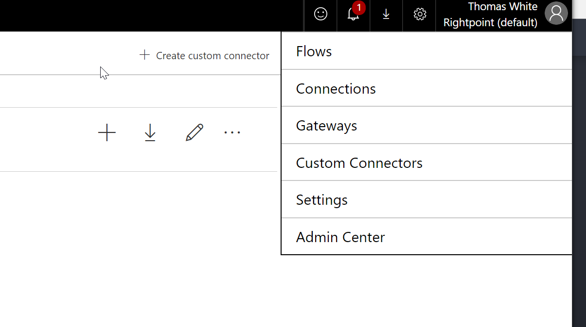
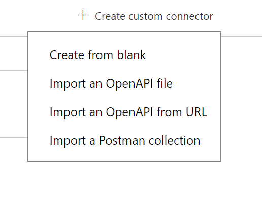
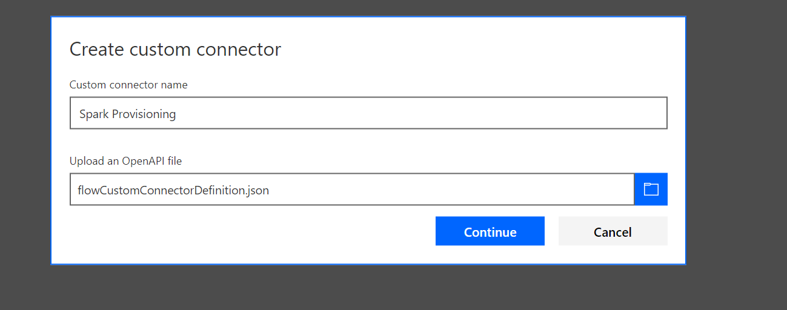
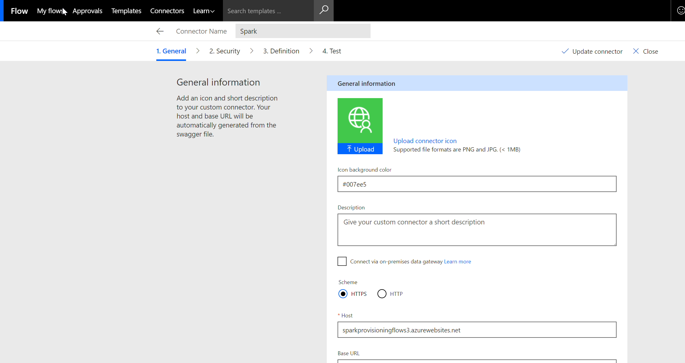
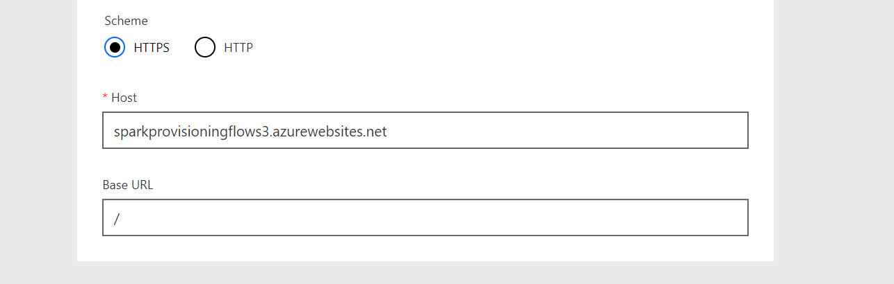
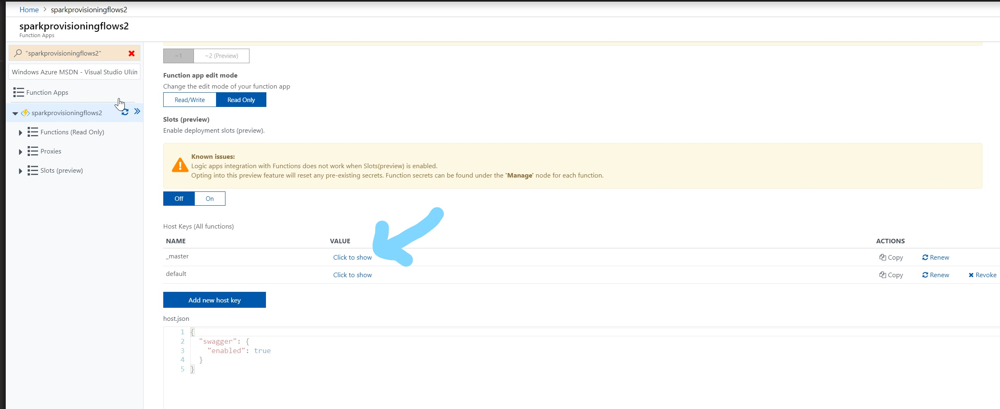
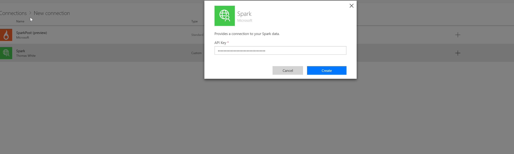

## Add Custom Connector

1. First, go to Microsoft Flow in your O365 tenant. In the top right corner click the gear icon and select "Custom Connectors".

2. Then, click the "Create custom connector button", and select "Import an OpenAPI file"

The file that needs to be uploaded is found in the folder downloaded from the Release of the provisioning engine project.

Once the file is uploaded, you should see a page similar to:

3. At the bottom there is a setting for "Host". This url needs to be set to the url of the Function app of the provisioning engine.

After updating the url, click the "Update connector" button in the top right. No changes should be made on the Security, Definition, or Test pages. The Connector is now created.

## Create Connection using Custom Connector

1. Now your custom connector is created within Microsoft Flow. However, before it can be used we must set up a Connection with it. This is where the api key to the function app is set. Locate your api key from the Function App for the engine. You can find this through the Azure Portal by navigating to the app and finding Function App Settings. You want to get the _master key from here, not default.

2. Once you have the api key, you can create the Connection reference. From Flow, click the gear icon and select "Connections".

This will take you to a page where it lists all available Flow Connections. There are many third party services in here, so you may need to use the search functionality to find the custom connector we added before. You need to add a new connection for "Spark".

4. Paste the function api key into the popup and select Create.

The Flow Custom Connector is now set up and available for use in Microsoft Flow.

## Share Connector with users
Once the custom connector is added to Flow, it is available to be shared with users. You should share the Flow with specific groups and users that are tasked with creating the Flows. 